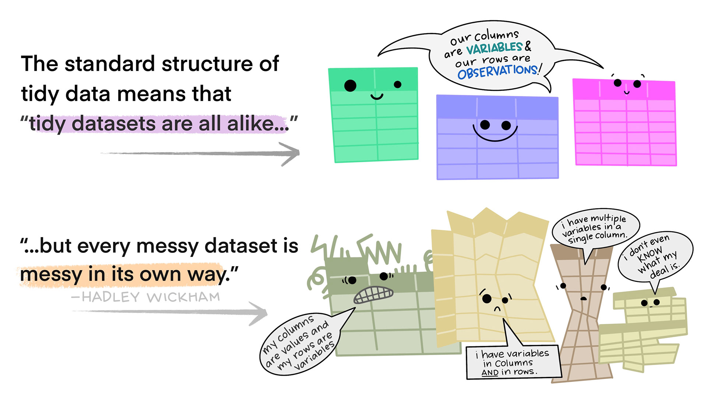

```{r setup, include=FALSE}
knitr::opts_chunk$set(echo = TRUE)
```

# Making Untidy Data Tidy

```{r}
library(here)
```

This week's lessons are about how to take untidy data tidy.

First, let's remind ourselves what out "tidy" data means.


Unfortunately, a lot of existing data doesn't follow these rules. The way in which datasets are untidy are always unique.



However, to analyze the data, we typically need data to be in a tidy format. We can use a number of functions from the `tidyr` package in the `tidyverse` to help make the data tidy.

## Set-up

First, let's load the `tidyverse`.

```{r}
library(tidyverse)
```

Now, let's read in our data for this lesson.

```{r}
macroplots <- read_tsv("http://datacarpentry.org/semester-biology/data/Macroplot_data_Rev.txt")
head(macroplots)
```

Let's take a look. These data are tree girths from the Western Ghats, a mountainous region on the western edge of the Indian peninsula. This area is considered one of the top biodiversity hotspots in the world.

Any time that a tree had more than one stem (trunk), the diameter of each stem got entered into a new column.

Is this good data structure?

Right now, each tree is one row, but will need some data wrangling. Better: Make a new row if a tree has more than one trunk. Add a tree ID column so that we know which tree each stem belongs to.

Before we get started, let's add a `treeid` column to our data frame using the `mutate` function from `dplyr`. We want one `treeid` for each row because there is one tree for each row

```{r}
macroplots <- macroplots %>% 
  # specify the col that you want your new col to show up before
  mutate(TreeID = 1:n(), .before = PlotID) 

macroplots
```

## Wide Data vs. Long Data

One of the key ways that we need to wrangle data is between "wide" format and "long format."

**Wide Data**

{width="50%"}

Might want to change the Sites to their own column. Wide data has issues with maintaining data in column names. Better to store your data in wide format, but sometimes you do need wide data.

**Long Data**

{width="50%"}

One common issue with wide data is that data is spread over multiple columns that should be in one. For example, in the tables above, the "Sites" as column names are violating the rule of not having data in column names. Instead, that data should be in one column, like in the long data.

To get the data in this form, we can use a function from `tidyr` called `pivot_longer`.

## Pivot Longer

The `pivot_longer()` function takes the following arguments (as we as many other optional arguments).

-   the data frame
-   columns to include (or not include)
-   `names_to`: the name of the new column to put the column names in
-   `values_to`: the name of the new column to put the column values in

Any redundant or unnecessary columns will be automatically removed.

```{r}
macrolong <- macroplots %>% 
  # can use : to specify TreeGirth1 through TreeGirth5
  pivot_longer(TreeGirth1:TreeGirth5,
               # "Stem" will hold the repeating names of the cols
               names_to = "Stem",     
               # "Girth" will hold the measurements from the girth cols
               values_to = "Girth")   

head(macrolong)
```

As a reminder, the colon specifies all columns starting at `TreeGirth1` and ending at `TreeGirth5`

#### Let's Practice!

Try out Question 1a.

### Replace Values with NAs

As you might have noticed, there are still 0s where there were no stems. We probably don't want those zeros to still be there. Instead, we might want them to be `NA` values.

To do so, we can use a function (from `dplyr`) called `na_if`. This function allows us to replace certain values with `NA`. We can use this function within a `mutate` function.

*Will look in a vector, give value, if you find this value in this vector, turn it to NA.*

The arguments in `na_if` are the vector (column) you want the values replaced in and the value to be replaced.

```{r}
macrolong <- macrolong %>% 
  # use same col name of what you want to overwrite
  mutate(Girth = na_if(Girth, 0))  

# now have NA values instead of zeros
head(macrolong)   
```

### Drop Rows with `NA` Values

Often, we might want to remove these rows altogether. To remove rows that have `NA` values in a specific column, we could use the `filter` function and `!is.na()`, as we have in the past. Alternatively, we could use the `drop_na()` function, which does the same thing.

```{r}
macrolong <- macrolong %>% 
  # if you run drop_na() empty, it will drop every row with an NA in any col,
  #  here we will only drop rows with an NA in "Girth"
  drop_na(Girth)  

macrolong
```

### `extract()` Values from a Column

There are a number of ways that we can work with character strings, and we will cover many of those more in depth in another lesson. For now, we will stick to one helpful function called `extract()`.

Let's say we want the `Stem` column to have only the number of the stem (1-5) rather than "TreeGirth1".

`extract()` will extract one or more values from a column. It uses something called "regular expressions." We might get into details about regular expression later, but we won't worry about them too much for now.

The arguments for `extract` are:

-   the data frame
-   the name of the column from which we want to extract something
-   the name(s) of the new column(s)
-   the regular expression specifying what to extract

```{r}
macrolong %>% 
  # name of col we want to extract from
  extract(Stem,
          # name of col we want to create
          "Stem", 
          # describe what we are removing, the () say this it the part of the 
          #  character string that we want the "." says that it can be anything 
          #  after TreeGirth and we want to keep that.
          regex = "TreeGirth(.)")  

macrolong
```

Here, `TreeGirth.` means the phrase "TreeGirth" followed by a single value. The `()` indicate what part of this string to extract, so just the number at the end of the string.

This gives us the result we want, with just the stem number in the `Stem` column.

*You may notice that this number is on the left side of the column, not the right. That's because the number is still stored as a character, because it was extracted from a character string.*

To convert it to it's actual type (numeric), we can add the optional argument `convert = TRUE` to `extract`.

```{r}
macrolong <- macrolong %>% 
  #convert will change it to the proper data class
  extract(Stem, "Stem", "TreeGirth(.)", convert = TRUE) 

# "Stem" is now seen as an integer
macrolong 
```

Adding the `convert = TRUE` argument is a helpful addition when extracting numbers so you can then work with the column as numbers.

#### Let's Practice!

Try question 1b.

### `separate()` a Column into Multiple Columns

In the `SpCode` column, the Genus and Species information for each tree are combined in a single column. If we want to group by genera, for example, having these data separated might be useful.

We can do so using the `separate()` function, which takes the following arguments:

-   the data frame
-   the name of the column to separate
-   new column names
-   the separator value, character, or position

```{r}
macrolong <- macrolong %>% 
  # name of col with values we want to separate
  separate(SpCode,   
           # names of cols we are creating, in c() because there are >1 of them
           c("Genus", "Species"), 
           # tell fn how to split them. this specifies that we want the split to 
           #  occur after 4 characters in.
           # if separating by a special character (i.e."-", " ", etc.), 
           #  need to put in ""
           sep = 4)  
macrolong
```

#### Let's Practice!

Try questions 6a and 6b.

## Pivot Wider

Occasionally, we need to convert data the other way: from long to wide.

For example, this is fairly common for analyses of community-level data. Many packages will want cross-tab (or wide) data, such as a site by species matrix.

Let's demonstrate with an example calculating the number of stems per species. First, we need to group and summarize the data.

```{r}
stem_counts <- macrolong %>% 
  group_by(PlotID, Genus, Species) %>% 
  summarise(Count = n())

head(stem_counts)
```

To get the site x species matrix, we need to make the dataset wider. Since the species ID will end up as column names, we need to bring the columns back together.

### `unite` Columns into One

To bring multiple columns together into one column, we use a function that does the opposite of `separate()`: \`unite().

We specify the data, the name of the new column, and the columns to combine.

```{r}
stem_counts <- stem_counts %>% 
  unite("SpeciesID", Genus, Species, sep = "_")
head(stem_counts)
```

There is also one species code for unknown species. While in long format, we would likely convert this to an `NA` value, because it will become a column name, we probably want to make it something interpretable.

To do this, we can use a combination of the mutate function with the `replace` function. The `replace` function is part of the `base` package that comes build into R.

The `replace` function, when used inside the `mutate` function, the arguments are:

-   the name of the column
-   the condition that, if met, means the value will be replaced
-   the value to use as the replacement

```{r}
filter(stem_counts, SpeciesID == "UnID_")

stem_counts <- stem_counts %>% 
  mutate(SpeciesID = replace(SpeciesID, SpeciesID == "UnID_", "UnknownID"))

filter(stem_counts, SpeciesID == "UnknownID")
```

Now we can go ahead and convert the data into a wider format.

### `pivot_wider()`

Using `pivot_wider()` will spread values from one column into column names. It will then fill in the appropriate values. It has many arguments, but these are the required ones:

-   the data frame
-   the name of column to use for column names
-   the name of column that contains the values to fill in the cells

```{r}
stem_counts %>% 
  pivot_wider(names_from = SpeciesID, values_from = Count)
```

Ok, that is a lot of `NA` values...

In this case, it would likely make sense to replace these `NA` values with 0. We can do this in a couple ways. With `pivot_wider()`, there is an optional argument to specify what value to use for any empty cells after the conversion.

```{r}
stem_counts %>% 
  pivot_wider(names_from = SpeciesID, 
              values_from = Count,
              values_fill = 0)
```

## Completing Data with Gaps

In some datasets, people might write out a value once and then leave the following rows blank, assuming that all of the following rows are the same value until a new value is present.

This is human-readable but not computer-readable.

```{r}
gappy_data <- read.csv("http://www.datacarpentry.org/semester-biology/data/gappy-data.csv",
                       na.strings = "")
gappy_data
```

We can fill in these gaps using the `fill()` function. The default direction is "down," but other directions are possible.

```{r}
complete_data <- gappy_data %>% 
  fill(Species)
head(complete_data)
```

## Renaming Columns

Last but very much not least, we often need to change the names of columns.

Let's read in a new .csv file with some less-than-desirable column names.

```{r}
rodents <- read_csv("https://raw.githubusercontent.com/bleds22e/santa-cruz-rodents/main/data/capture_raw.csv")

colnames(rodents)
```

We can select a few columns: date, site, and trap ID.

```{r, eval=FALSE}
rodents %>% select(Date, Site, Trap ID)
```

Well, that doesn't work. How do we get around it? We use backticks to deal with names with spaces or special charaters.

```{r}
rodents %>% select(Date, Site, `Trap ID`)
```

While function, this get gets annoying after a while. Thankfully, the `tidyverse` has a helpful function for renaming columns.

The argument in `rename()` is the new name of the column equal to the old name.

```{r}
rodents <- rodents %>% 
  rename(TrapID = `Trap ID`)
head(rodents)

rodents %>% select(Date, Site, TrapID)
```
